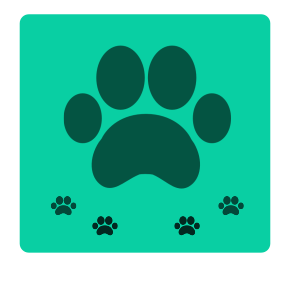
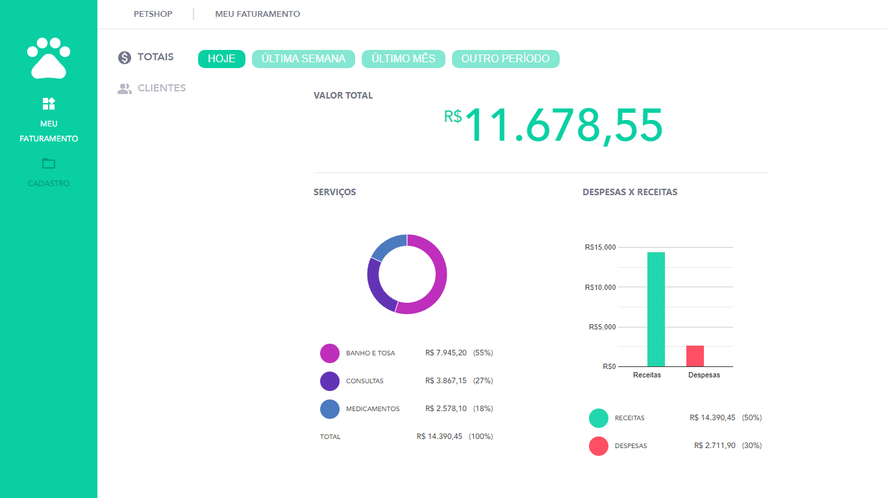
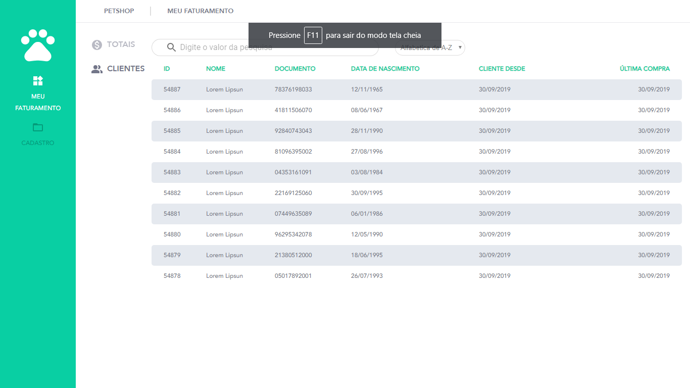

<div align="center">
  </img>
</div>

<h1 align="center"> <strong> Teste Eyemobile-Frontend-React </strong> </h1>

<p align="center">Projeto <strong>App-Reduce-Petshop</strong></p>

<p align="center">
  <a aria-label="Versão do React" href="#">
    </img>
  </a>

  <a aria-label="Versão do Redux" href="#">
    </img>
  </a>

  <a aria-label="Versão do Chart" href="#">
    </img>
  </a>

  <a aria-label="Material-ui" href="#">
    </img>
  </a>

  <a aria-label="Material-ui" href="#">
    </img>
  </a>

  <a aria-label="License" href="#">
    </img>
  </a>  
</p>

## Informações Gerais
Projeto em fase de desenvolvimento, sistema de gerenciamento para Petshop.

## Instalação
Para que o projeto funcione corretamente você deverá clonar o projeto e inicializá-lo executando:
```bash
yarn install
yarn start
```

## Backend 
O projeto em questão utiliza como base de dados o arquivo json disponibilizado no projeto. 

## Frontend

### Page 1
Web -> tela de resultados:

</img>

### Page 2
Web -> tela de listagem de clientes:

</img>

## Licença

[MIT](./LICENSE) .